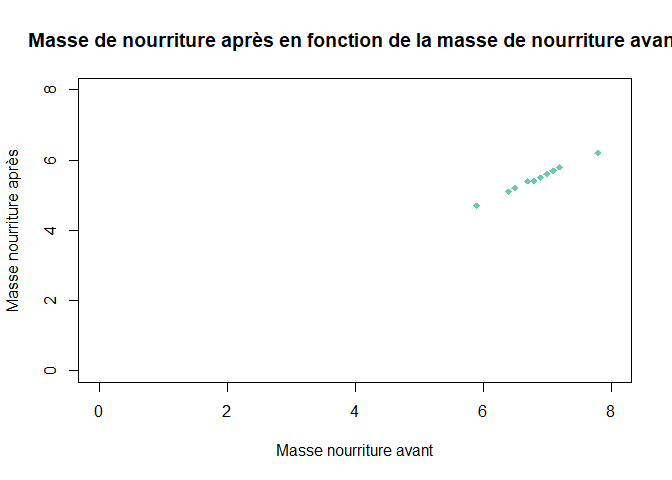
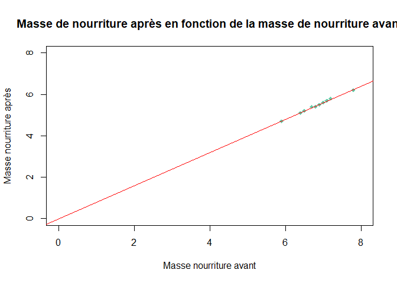
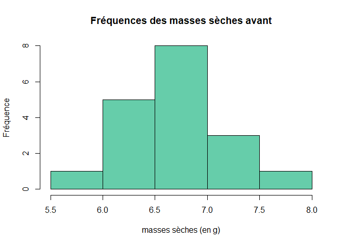
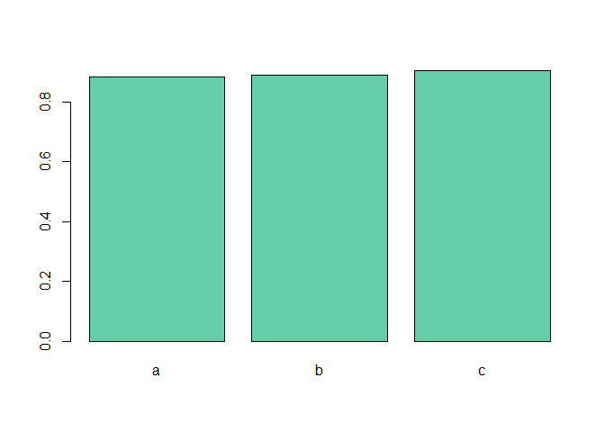
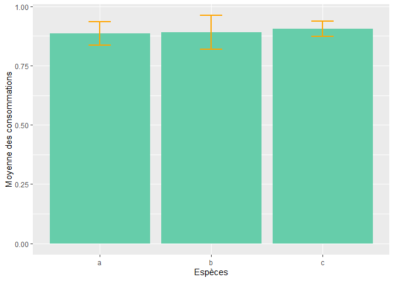
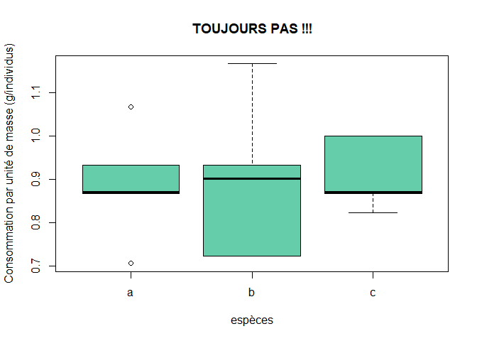

# Télécharger R et RStudio

Vous devez d'abord télécharger :

1. R, c'est ici <https://cloud.r-project.org/>
2. RStudio, c'est là <https://rstudio.com/products/rstudio/download/>


# 1. Ouverture de votre fichier Excel

### 1.1 - Enregistrement du fichier de données au format .csv 
  
Pour ouvrir votre fichier de données sur RStudio, il faut l'enregistrer dans un format **.csv**. 

➥ Fichier > Enregistrer sous > Type ==> CSV (séparateur : point virgule). 

### 1.2 - Renseigner votre chemin d'accès

Pour que RStudio sache où aller chercher votre fichier dans votre ordinateur, il faut lui dire où aller. Pour cela, vous devez définir le chemin du répertoire de travail (ou dossier) dans lequel vous allez travailler. <br> 
Deux façons de faire, à vous de choisir celle que vous préférez :

1. Via `setwd()`

Vous pouvez utiliser la commande `setwd()` : **set** pour **définir** et **wd** pour **working directory**, répertoire de travail en anglais. 


```r
setwd("C:/Users/camil/Camille/1_These/5_Monitorat/R_Github_repo/Aide_R_cours")
```

2. Façon clique bouton 

Aller dans Session > Set Working Directory > Choose Directory ... ou Ctrl+Shift+H. <br>
Aller dans le répertoire de travail où se trouve votre fichier de données. 

### 1.3 - Ouvrir le fichier .csv
Vous allez utiliser la commande `read.csv()`, et lui renseigner trois informations :

1. Le nom de votre fichier avec `file = "le_nom_de_votre_fichier.csv"`.
2. Le type de séparateur entre vos colonnes avec `sep = ";"`. Ici vous avez un **;** car vous avez enregistrer votre fichier au format **CSV (séparateur : point virgule)**. 
3. Le caractère utilisé dans votre tableau pour rentrer les chiffres décimaux (chiffres à virgule) avec `dec = "," `. 


```r
data <- read.csv(file = "exemple.csv",
                 sep = ";",
                 dec = ",")

head(data)
```

```
##        id traitement espece poids_sec_av poids_sec_ap poids_animal
## 1 GP_t_01          1      a          6.5          5.2          1.5
## 2 GP_t_02          1      a          7.8          6.2          1.5
## 3 GP_t_03          1      a          6.4          5.1          1.5
## 4 GP_t_04          1      b          6.8          5.4          1.6
## 5 GP_t_05          1      b          6.7          5.4          1.8
## 6 GP_t_06          1      b          7.1          5.7          1.2
```

La première étape est terminée ! <br>


# 2. Manipulation du tableau de données.

### 2.1 - Sélectionner certaines lignes/colonnes. 
Il y a deux façons de sélectionner des lignes/colonnes. Soit en indiquant le numéro de la colonne, soit en indiquant le nom de la colonne que vous voulez. 
Dans les deux cas, il faudra utiliser la syntaxe suivante : <br> `nom_tableau[n°ligne, n°colonne]` ou `nom_tableau["nom ligne", "nom colonne"]`. 

**Si vous voulez sélectionner la colonne n°2 de votre tableau : **

```r
data[, 2]
```

```
##  [1] 1 1 1 1 1 1 1 1 1 0 0 0 0 0 0 0 0 0
```

```r
data[, "traitement"]
```

```
##  [1] 1 1 1 1 1 1 1 1 1 0 0 0 0 0 0 0 0 0
```

```r
data$traitement # le $ est une sorte de raccourci pour dire colonne
```

```
##  [1] 1 1 1 1 1 1 1 1 1 0 0 0 0 0 0 0 0 0
```

**Si vous voulez toutes les informations de votre individu n°5 :**

```r
data[5, ]
```

```
##        id traitement espece poids_sec_av poids_sec_ap poids_animal
## 5 GP_t_05          1      b          6.7          5.4          1.8
```

```r
data["5", ]
```

```
##        id traitement espece poids_sec_av poids_sec_ap poids_animal
## 5 GP_t_05          1      b          6.7          5.4          1.8
```

**Si vous voulez sélectionner la masse (colonne n°6) de l'individus n°3 : **

```r
data[3, 6]
```

```
## [1] 1.5
```

```r
data[3, "poids_animal"]
```

```
## [1] 1.5
```

### 2.2 - Ajouter des colonnes

Dans certains cas, vous allez devoir faire de petits calculs, comme la quantité de nourriture ingérée. <br>

Il faut donc dire à l'ordinateur que vous voulez créer une nouvelle colonne **conso_tot** dans le tableau **data** via `data$conso_tot`. Cette nouvelle colonne est égale à la masse de nourriture avant l'expérience `data$poids_sec_av` moins la masse de nourriture après l'expérience `data$poids_sec_ap`. <br>
En langage R, ça donne :


```r
data$conso_tot <- data$poids_sec_av - data$poids_sec_ap
head(data)
```

```
##        id traitement espece poids_sec_av poids_sec_ap poids_animal conso_tot
## 1 GP_t_01          1      a          6.5          5.2          1.5       1.3
## 2 GP_t_02          1      a          7.8          6.2          1.5       1.6
## 3 GP_t_03          1      a          6.4          5.1          1.5       1.3
## 4 GP_t_04          1      b          6.8          5.4          1.6       1.4
## 5 GP_t_05          1      b          6.7          5.4          1.8       1.3
## 6 GP_t_06          1      b          7.1          5.7          1.2       1.4
```

De la même façon,vous pouvez calculer la consommation par unité de masse :

```r
data$conso_masse <- (data$poids_sec_av - data$poids_sec_ap)/data$poids_animal
head(data)
```

```
##        id traitement espece poids_sec_av poids_sec_ap poids_animal conso_tot
## 1 GP_t_01          1      a          6.5          5.2          1.5       1.3
## 2 GP_t_02          1      a          7.8          6.2          1.5       1.6
## 3 GP_t_03          1      a          6.4          5.1          1.5       1.3
## 4 GP_t_04          1      b          6.8          5.4          1.6       1.4
## 5 GP_t_05          1      b          6.7          5.4          1.8       1.3
## 6 GP_t_06          1      b          7.1          5.7          1.2       1.4
##   conso_masse
## 1   0.8666667
## 2   1.0666667
## 3   0.8666667
## 4   0.8750000
## 5   0.7222222
## 6   1.1666667
```

# 3. Production des figures

Pour illustrer vos résultats, il existe de multiples types de graphiques!
Sur ce site (<https://www.r-graph-gallery.com/index.html>) vous trouverez de nombreuses idées et la façon de les coder. Pour chaque type de graphique, il y a deux façons de les coder: soit en utilisant un outil particulier qui s'appelle `ggplot2` soit en codant en `base R` comme on fait depuis le début du tutoriel. Dans un premier temps nous vous recommendons de suivre la version de code `base R` lorsque les deux sont proposées 💡
<br>

### 3.1 Produire un nuage de points 

La fonction `plot()` vous permet de construire un nuage de point en utilisant deux colonnes de votre tableau. la syntaxe est la suivante <br>
`plot(x = variable_à_mettre_en_abscisse, y = variable_à_mettre_en_ordonnées)` .
<br>

De plus, vous pouvez utiliser de multiples arguments afin de changer les couleurs, les formes (etc.) utilisées dans le graphique. Par exemple : 

* l'argument `cex` permet de spécifier la taille des symboles utilisés.
* les arguments `xlim` et `ylim` permettent de fixer les limites des axes x et y.
* les arguments `xlab` et `ylab` permettent de fixer le nom des axes x et y.
* l'argument `col` permet de fixer la couleur des points (voici une liste des possibles couleurs dans R: <http://www.stat.columbia.edu/~tzheng/files/Rcolor.pdf>). 
* l'argument `pch` permet de choisir la forme des points (cercles, carrés, losanges...).
<br>
* l'argument `main` permet d'ajouterun titre en haut du graphique. Cependant les titres devant être en dessous des graphiques, n'utilisez pas cet argument dans vos code.

Avec les données de l'exemple, nous pouvons représenter le nuage de points de la consommation par unité de masse en fonction de la masse de nourriture avant l'expérience avant même si ce n'est pas très intéressant (mais pour vous montrer sur un exemple concret comment ça se code):


```r
plot(x = data$poids_sec_av, y = data$poids_sec_ap,
     xlim = c(0, 8), ylim = c(0, 8), 
     pch = 18, 
     cex = 1, 
     col = "aquamarine3",
     xlab = "Masse nourriture avant", ylab = "Masse nourriture après",
     main = "NE PAS METTRE DE TITRE ! \n Le titre va en-dessous de la figure dans votre rapport")
```

<!-- -->
<br>

### 3.2 - Insérer une courbe de régression (et calculer un coefficient de corrélation)

#### 3.2.1 - Insérer une courbe de régression

Pour créér une ligne de régression qui modélise les données, il faut créer un modèle de régression. Ici nous resterons sur les modèles linéaires (de la forme y = ax + b). 
<br>

Pour créer le modèle on utilise la fonction `lm()` (pour **L**inear **M**odel). Sa syntaxe est la suivante:<br>
 `lm(variable_à_mettre_en_y ~ variable_à_mettre_en_x)`.
<br>


```r
# 1/ on créé un modèle pour voir s'il peut "fitter" les données?
model <- lm(data$poids_sec_ap ~ data$poids_sec_av)
```

Une fois le modèle de régression créé, il faut regarder les propriétés du modèle, notamment combien de variation de la variable que je cherche à expliquer (celle qui est en y) notre modèle explique. On fait ça en regardant la valeur du R2. Le R2 exprime **le pourcentage de variation de la variable y expliqué par le modèle**. Donc plus le R2 est grand, plus le modèle explique bien la variation observée  💡 Pour aller chercher la valeur de R2, on utilise la commande <br>
`nom_du_modèle$adj.r.squared`<br>

On peut ensuite regarder les coefficients du modèle, c'est-à-dire la valeur de la pente et la valeur de l'ordonnée à l'origine.
<br>


```r
# 2/ on regarde les propriétés de ce modèle:

## le R2 qui exprime le pourcentage de variation de y qui est expliqué par le modèle:
summary(model)$adj.r.squared
```

```
## [1] 0.9921853
```

```r
## les coefficients du modèle c'est à dire l'ordonnée à l'origine et la pente:
model$coefficients
```

```
##       (Intercept) data$poids_sec_av 
##        -0.0243083         0.8027668
```

Une fois les proriétés du modèle vérifiées, on peut afficher la droite de régression en utilisant la fonction `abline()`. L'argument de la fonction est tout simplement le modèle créé précédemment avec la fonction `lm`.
<br>


```r
# 3/ On peut ensuite refaire le graphique précédent en ajoutant la droite de régression 
# grace à la fonction abline():
plot(x = data$poids_sec_av, y = data$poids_sec_ap,
     xlim = c(0, 8), ylim = c(0, 8), 
     pch = 18, 
     cex = 1, 
     col = "aquamarine3",
     xlab = "Masse nourriture avant (g)", 
     ylab = "Masse nourriture après (g)",
     main = "NE PAS METTRE DE TITRE ! \n Le titre va en-dessous de la figure dans votre rapport")
abline(model, col = "red")
```

<!-- -->
<br>

#### 3.2.2 - Calculer un coefficient de corrélation

Pour calculer le coefficient de correlation entre deux variables, il faut utiliser la fonction `cor()` suivant la syntaxe suivante:<br>
 `cor(variable_1 , variable_2, method = c("pearson"))`. Ici on utilise un coefficient de pearson car les deux variables à étudier sont continues.<br>

💡 **Correlation n'est pas causalité! **


```r
cor(data$poids_sec_av, data$poids_sec_ap, method = c("pearson"))
```

```
## [1] 0.9963157
```
<br />


### 3.3 - Produire un histogramme 
<br />


Pour produire un histogramme, on utilise la fonction `hist()`. Les arguments pour le titre, la couleur et le nom des axes sont les mêmes que ceux vus dans la partie **3.1**. Vous pouvez choisir de représenter la fréquence d'une variable unique comme suit pour la variable de la masse sèche avant l'expérience:
<br />


```r
hist(data$poids_sec_av, 
     col = "aquamarine3", 
     main = "TOUJOURS PAS DE TITRE ICI", 
     xlab = "masses sèches (en g)", 
     ylab = "Effectif")
```

<!-- -->
<br />


### 3.4 Produire un barplot et les barres d'erreur associées
<br />


#### 3.4.1 Produire un barplot
<br />


Pour produire un barplot on utilise la fonction `barplot()` suivant la syntaxe suivante:
<br>
`barplot(height = nom_variable_à_mettre_en_y, names = nom_variable_à_mettre_en_x)`
<br />

Ici nous allons **représenter les moyennes des consommations par unité de masse en fonction des espèces**.
Dans un **premier temps**, il faut **calculer les moyennes de consommation pour chaque espèce** et les ajouter au tableau de données.
<br />

💡 Pour calculer la consommation moyenne par espèces, il faut aller **extraire dans le tableau les données propres à chaque espèces séparément**.
Par exemple, pour l'espèce a, on demande à l'ordinateur d'aller dans le tableau `data` et d'extraire dans la colonne `data$conso_masse`, les valeurs pour lesquelles (d'où le `which`) l'espèce est l'espèce a.
En langage R, ça donne : 
<br />


```r
data$conso_masse[which(data$espece == "a")]
```

```
## [1] 0.8666667 1.0666667 0.8666667 0.8750000 0.9333333 0.7058824
```
<br />

Pour prendre la moyenne de ces valeurs, on utilise la fonction `mean()` (moyenne en anglais) comme suit : 
<br />


```r
mean_esp_a <- mean(data$conso_masse[which(data$espece == "a")])
```
<br />

On fait la même chose pour les espèces restantes :
<br />


```r
# Calcul des moyennes de consommation pour chaque espèce:
mean_esp_b <- mean(data$conso_masse[which(data$espece == "b")])
mean_esp_c <- mean(data$conso_masse[which(data$espece == "c")])
```
<br />

Ensuite, nous **créons un nouveau tableau de données** pour qu'il contienne les moyennes de consommation pour chaque espèce:

```r
data_mean <- data.frame(espece = c("a", "b", "c"), mean = c(mean_esp_a, mean_esp_b, mean_esp_c))
```
<br>

Enfin, pour chaque ligne (correspondant à une espèce) du nouveau tableau, on **ajoute les valeurs** des moyennes associées:
💡 On utilise la fonction `round` pour arrondir les décimales des moyennes à la 3ème décimale ici:
<br />


```r
data_mean[1, "mean"] <- round(mean_esp_a, 3)
data_mean[2, "mean"] <- round(mean_esp_b, 3)
data_mean[3, "mean"] <- round(mean_esp_c, 3)
```
<br>

On peut alors mettre en place le **barplot des moyennes de consommation en fonction des espèces**:

```r
barplot(height = data_mean$mean, names = data_mean$espece, col = "aquamarine3")
```

<!-- -->

<br />


#### 3.4.2 Produire un barplot avec les barres d'erreur associées
<br />


Pour produire un barplot avec les barres d'erreur associées, il est beaucoup plus facile de fonctionner avec l'outil `ggplot2` qu'avec `R base`. Ici nous allons donc vous montrer comment coder ça en utilisant `ggplot2`. Nous allons de nouveau représenter les moyennes des consommations par unité de masse en fonction des espèces.

<br />

La première chose à faire est de **calculer l'intervalle de confiance de chaque moyenne de consommation**. C'est cet intervalle qui sera représenté dans les **barres d'erreur**. Le calcul de l'intervalle de confiance passe par le calcul de différentes valeurs: la moyenne (déjà réalisé plus haut), l'écart-type et l'erreur type. dans le code suivant, on récipère les lignes correspondant aux espèces voulues comme réalisé en 3.4.1:
<br />


```r
## Exemple détaille pour l'espèce a: 

# Calcul de l'écart type des consommation pour l'espèce a:
sd_a <- sd(data$conso_masse[which(data$espece == "a")])

# Calcul de l'erreur type des consommations pour l'espèce a:
se_a <- sd_a/nrow(data[which(data$espece == "a"), ])

# Calcul de l'intervalle de confiance pour l'espèce a:
ic_a <- se_a * qt(0.975, nrow(data[which(data$espece == "b"), ]) - 1)

## On réalise la même chose pour les deux espèces restantes:
sd_b <- sd(data$conso_masse[which(data$espece == "b")])
se_b <- sd_b/nrow(data[which(data$espece == "b"), ])
ic_b <- se_b * qt(0.975, nrow(data[which(data$espece == "b"), ]) - 1)

sd_c <- sd(data$conso_masse[which(data$espece == "c")])
se_c <- sd_c/nrow(data[which(data$espece == "c"), ])
ic_c <- se_c * qt(0.975, nrow(data[which(data$espece == "c"), ]) - 1)
```
<br />

On peut ensuite **ajouter ces données au nouveau tableau** créé plus haut: 
<br />


```r
data_mean$ic <- c(ic_a, ic_b, ic_c)
```
<br />


Et enfin **représenter le barplot avec les barres d'erreur**!
<br />

💡Pour comprendre le fonctionnement de l'outil `ggplot`, il faut s'imaginer qu'il fonctionne en ajoutant couches du graphique sur couches du graphique. Par exemple, dans notre cas, nous allons d'abord lui spécifier avec quelles données nous travaillons en utilisant la fonction `ggplot`, puis nous lui spécifions que nous voulons réaliser un barplot en utilisant la fonction `geom_bar` et enfin nous lui spécifions que nous voulons ajouter des barres d'erreurs en utilisant la fonction `geom_errorbar`. Nous pouvons aussi changer le nom des axes en utilisant la fonction `labs`.
Au sein des fonctions `geom_bar` et `geom_errorbar` (ainsi que toutes les fonctions qui permettent d'ajouter des "couches graphiques"), il faut indiquer quelles données vont être utilisées en abscisse et en ordonnées pour tracer les couches  et d'autres paramètres notamment pour les options de couleurs:
<br />


```r
# On appelle l'outil ggplot2 (à installer avant si besoin: install.packages("ggplo2"))
library(ggplot2)

## On trace le graphique:
ggplot(data_mean) +
  geom_bar(aes(x = data_mean$espece, y = data_mean$mean), stat = "identity", 
           fill = "aquamarine3") +
  geom_errorbar(aes(x = data_mean$espece, ymin = data_mean$mean - data_mean$ic, ymax = data_mean$mean +     data_mean$ic), width = 0.2, colour = "orange",  size = 1) +
  labs(x = "Espèces", y = "Moyenne des consommations")
```

<!-- -->
<br />

💡 Remarque 1: aes(x = ..., y = ...) permet d'indiquer les données de chaque couche à mettre en abscisse et ordonnées
<br />

💡 Remarque 2: pour tracer les barres d'erreur correspondant à l'intervalle de confiance on ajoute (pour la barre haute) ou retire (pour la barre basse) à la moyenne l'étendue de l'intervalle de confiance. cf arguments ymin (barre basse) et ymax (barre haute)
<br />

💡 Remarque 3: le paramètre "fill" de la fonction geom_bar permet de définir la couleur remplissant les barplots, les paramètres "colour", "width" et "size" de la fonction geom_errorbar permettent de définir la couleur, l'épaisseur et la taille des barres d'erreurs
<br />


### 3.5 - Produire des boîtes à moustaches


<br />
Pour créér une boite à moustache, on utilise la fonction `boxplot()` comme suit:
<br>
`boxplot(variable_à_mettre_en_y ~ variable_à_mettre_en_x)`
<br>

Les arguments pour le titre, la couleur et le nom des axes sont les mêmes que ceux vus dans la partie **3.1**. Si on cherche à représenter la consommation par unité de masse en fonction de l'espèce, on code donc ainsi:
<br />


```r
boxplot(data$conso_masse ~ data$espece, 
        col = "aquamarine3", 
        main = "TOUJOURS PAS !!!", 
        xlab = "espèces", 
        ylab = "Consommation par unité de masse (g/individus)")
```

<!-- -->
<br />

Voilà, vous êtes arrivés à l'étape finale des graphiques! 
<br />


<br>

Encore une fois, il est possible de faire des figures via `ggplot2`. Vous trouverez votre bonheur ici ==> <https://www.r-graph-gallery.com/index.html>


